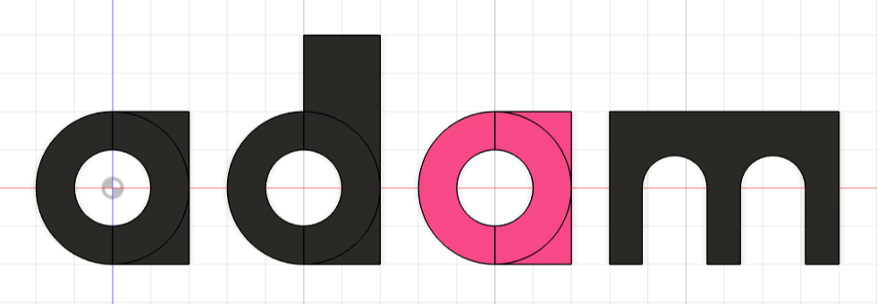

# Fusion 360 MCP Server



<sub>*Note: Colors were added manually*</sub>

Control Fusion 360 CAD software directly from Claude Desktop using the Model Context Protocol (MCP).

## Overview

This project provides an MCP server that allows Claude to create and manipulate 3D CAD models in Autodesk Fusion 360. Claude can sketch shapes, extrude them into 3D objects, and apply features like fillets and chamfers - all through natural language.

### Architecture
```
Claude Desktop
    | (MCP over stdio)
server.py (MCP Server)
    | (HTTP/JSON on localhost:8080)
fusion_http_server.py (Fusion 360 Script)
    | (Fusion 360 Python API)
Fusion 360 CAD Software
```

## Prerequisites

- **Fusion 360** - [Download here](https://www.autodesk.com/products/fusion-360)
- **Python 3.10+** - For running the MCP server
- **Claude Desktop** - [Download here](https://claude.ai/download)

## Setup

### 1. Clone the Repository
```bash
git clone https://github.com/KevinZhao-07/Fusion-Mcp-Server.git
cd Fusion-Mcp-Server
```

### 2. Install Python Dependencies
```bash
pip install mcp httpx
```

### 3. Install the Fusion 360 HTTP Server Script

1. Open Fusion 360
2. Go to **Utilities** → **Scripts and Add-Ins** (or press Shift+S)
3. Click the **+** button next to "My Scripts"
4. Navigate to `Scripts/fusion_http_server/`
5. The script should now appear in the list

### 4. Configure Claude Desktop

Add this to your Claude Desktop MCP configuration file:

**Windows:** `%APPDATA%\Claude\claude_desktop_config.json`

**macOS:** `~/Library/Application Support/Claude/claude_desktop_config.json`
```json
{
  "mcpServers": {
    "fusion-cad": {
      "command": "python",
      "args": [
        "C:/Users/YOUR_USERNAME/Desktop/Fusion-Mcp-Project/server.py"
      ]
    }
  }
}
```

Replace `YOUR_USERNAME` with your actual username, or use the full path to wherever you cloned the repo.

## Run Instructions

### Step 1: Start Fusion 360

Open Fusion 360 and create a new design (File → New Design).

### Step 2: Run the Fusion HTTP Server

1. In Fusion 360, go to **Utilities** → **Scripts and Add-Ins** (or press Shift+S)
2. Select `fusion_http_server` under "My Scripts"
3. Click **Run**
4. You should see: `Fusion HTTP Server started on port 8080!`

**Keep this running** - do not close the script dialog.

### Step 3: Start Claude Desktop

1. Launch Claude Desktop
2. The MCP server (`server.py`) will start automatically
3. Look for the hammer icon in Claude to confirm the MCP tools are loaded

## Quick Start Example

Once everything is running, try this in Claude Desktop:

> Create a 10x10 cm rectangle, extrude it 5 cm, and add a 1 cm fillet to all edges.

Claude will:
1. Create a rectangle sketch (10 cm x 10 cm)
2. Extrude it to create a 3D box (5 cm tall)
3. Round all the edges with a 1 cm radius fillet

You'll see the box appear in Fusion 360 in real-time!

### More Examples

**Create a cylinder:**
> Sketch a circle with radius 3 cm and extrude it 10 cm.

**Create a chamfered box:**
> Make a 5x5 cm rectangle, extrude 3 cm, then chamfer all edges with 0.5 cm distance.

**Cut a hole:**
> Sketch a circle with radius 2 cm, then use extrude cut with distance 10 cm.

## Available Tools

| Tool | Description |
|------|-------------|
| `create_rectangle` | Create a rectangle on the XZ plane |
| `sketch_line` | Draw a line on the XZ plane |
| `sketch_circle` | Create a circle (by radius or diameter) |
| `extrude_profile` | Extrude a sketch into a 3D body |
| `extrude_cut` | Cut through existing bodies |
| `fillet_edges` | Round all edges of the last body |
| `chamfer_edges` | Bevel all edges of the last body |
| `clear_all` | Clear the entire workspace |

## Troubleshooting

### "Cannot connect to Fusion server"
- Make sure Fusion 360 is running
- Verify the HTTP server script is running (Step 2 above)
- Check that you see "Fusion HTTP Server started on port 8080!"

### Tools not showing in Claude Desktop
- Verify your `claude_desktop_config.json` path is correct
- Restart Claude Desktop after editing the config
- Check the MCP logs in Claude Desktop settings

### Script won't run in Fusion
- Make sure you added the script folder, not just the `.py` file
- The folder must contain both `fusion_http_server.py` and `fusion_http_server.manifest`

### "Extrusion failed"
- Did you create a sketch first? Extrusions require a sketch profile
- Check that the sketch creates a closed profile (rectangles and circles work, single lines don't)

## Project Structure
```
Fusion-Mcp-Project/
├── server.py                 # MCP server (communicates with Claude Desktop)
├── README.md                 # This file
├── Notes.md                  # Design decisions and tradeoffs
├── requirements.txt          # Python dependencies
└── Scripts/
    └── fusion_http_server/
        └── fusion_http_server.py  # Fusion 360 HTTP server script
```